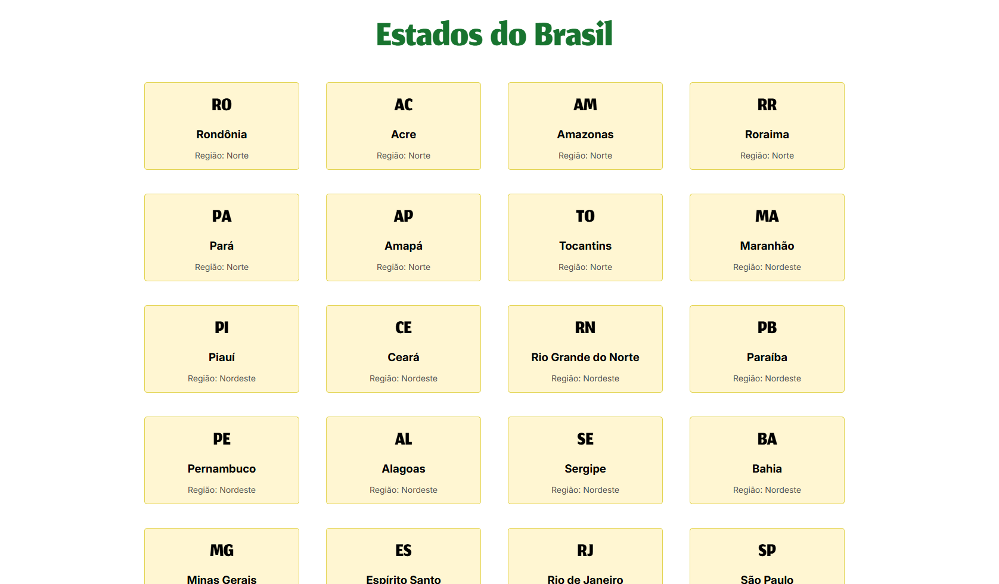
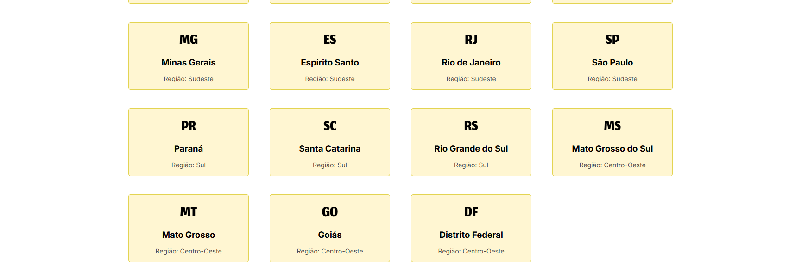

# ✦ Lista de Estados ✦

Projeto desenvolvido para a disciplina de **Programação para a Internet**.

A aplicação consome dados da API pública do IBGE e exibe informações dos 27 estados brasileiros em cartões contendo sigla, nome e região.

---

## ✧ Tecnologias Utilizadas

- React
- JavaScript
- CSS
- API de Localidades do IBGE

---

## ✧ Screenshot





---

## ✧ API Utilizada

https://servicodados.ibge.gov.br/api/v1/localidades/estados

---

## ✧ Funcionalidades

- Consumo de API com `fetch()`
- Uso de `useState` e `useEffect`
- Criação de componentes reutilizáveis com Props
- Renderização dinâmica dos dados utilizando `map()`
- Exibição dos 27 estados brasileiros

---

## ✧ Estrutura do Projeto

```text
src/
├── components/
│   ├── Estado.jsx
│   └── Estado.css
├── App.jsx
└── App.css
```

---

## ✧ Como Executar o Projeto

Clone o repositório:

```bash
git clone URL_DO_REPOSITORIO
```

Acesse a pasta do projeto:

```bash
cd lista-estados
```

Instale as dependências:

```bash
npm install
```

Execute o projeto:

```bash
npm run dev
```

---

## ✧ Exemplo de Cartão

```text
RN
Rio Grande do Norte
Região: Nordeste
```

```text
SP
São Paulo
Região: Sudeste
```

```text
AM
Amazonas
Região: Norte
```

---

Projeto desenvolvido com React utilizando componentes, props e consumo de API.